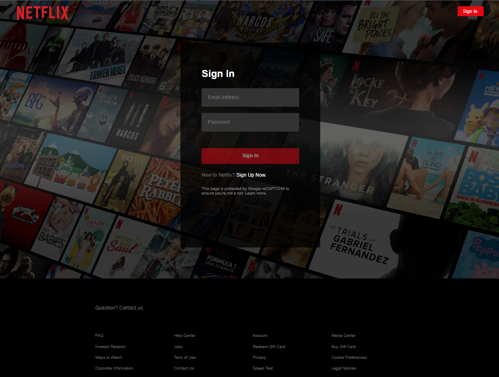
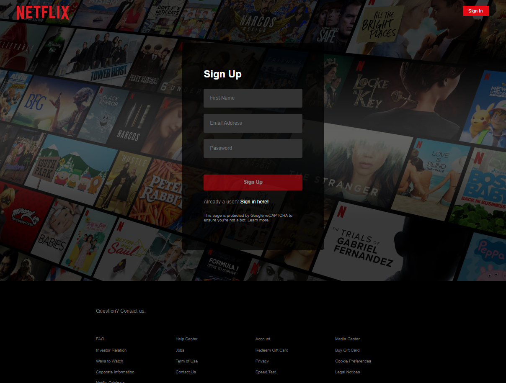
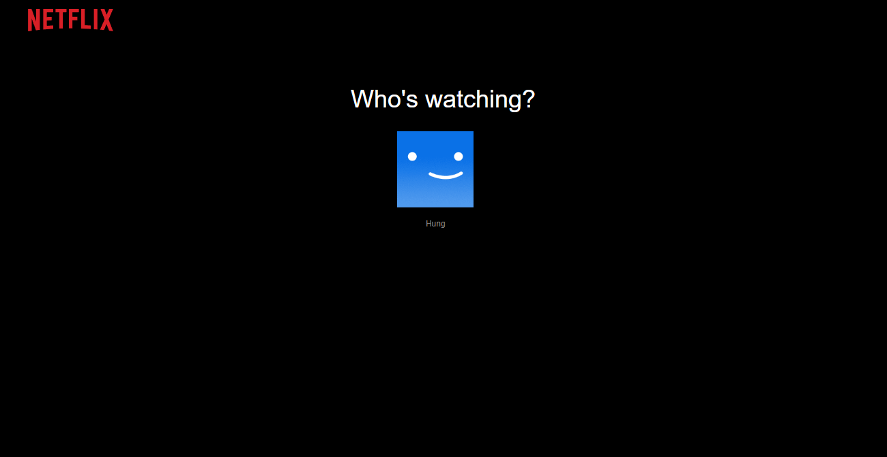
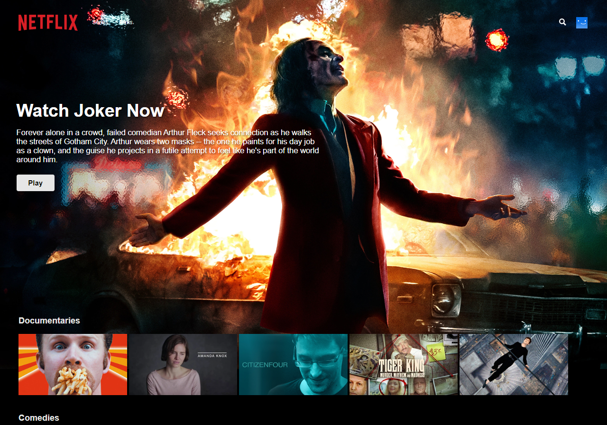

# NETFLIX CLONE WITH REACT AND FIREBASE

This project was done with React, Firebase and styled-components.
The project has a login and signup page.

Once you have the account, you can log in to the profile select page

Then, you can see the browse page when you choose your profile.

